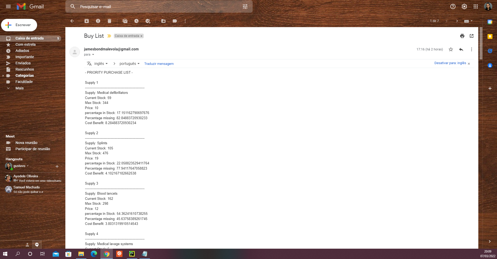
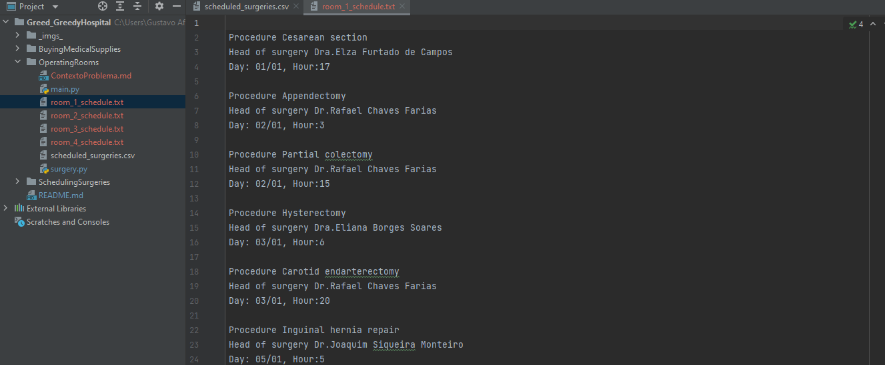
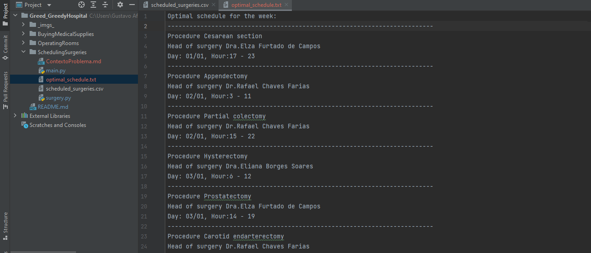

# Greedy Hospital

**Número da Lista**: 3 
**Conteúdo da Disciplina**: Greed 

## Alunos
|Matrícula | Aluno |
| -- | -- |
| 17/0034992  |  Gustavo Afonso Pires Severo  |
| 17/0011119  |  Geraldo Victor Alves Barbosa |

## Sobre 
O projeto visa demonstrar algoritmos gananciosos clássicos na liguem python, resolvendo situações enfrentadas no ambiente hospitalar, 
foram resolvidas 3 situações de problemas logísticos no ambiente hospitalar, usando claro algoritmos gananciosos.

- Scheduling Surgeries, é um problema de interval scheduling.
- Operating Rooms é um problema resolvido com interval partitioning.
- Buying medical supplies é um problema que demanda uma adaptação do knapsack ganancioso.

## Screenshots

Lista de compras gerada pelo código Buying medical supplies:

Agendas geradas no problema Operating Rooms:

Agenda gerada no problema Scheduling surgeries:

## Instalação 
**Linguagem**: Python3 
**Framework**: Não foi usado 

## Uso 
Para rodar o projeto para executar a main de cada situação problema.

## Outros 
- A biblioteca Pandas é usada no projeto, caso sua versão do python não a Pandas, basta instalar a versão mais recente.
- No código 'Buying medical supplies' existe um módulo configurado para enviar emails, caso você queira mandar emails como eu mostro no vídeo, veja como configurar suas credenciais na [documentação](https://docs.python.org/3/library/smtplib.html)

